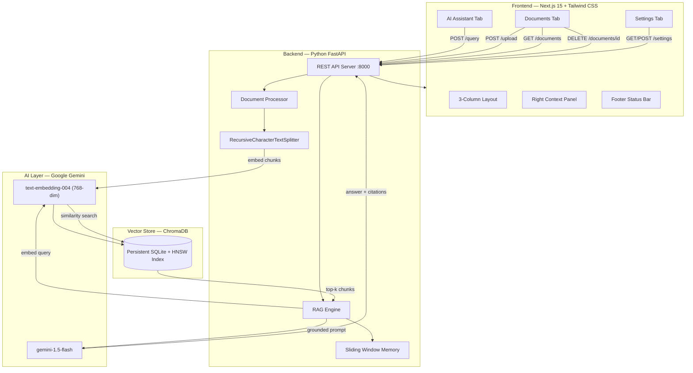
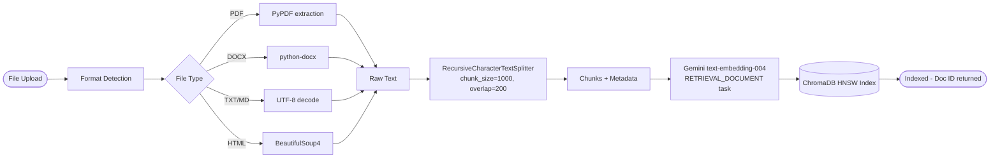
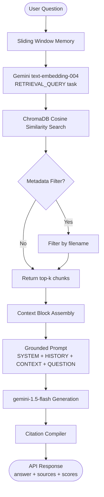

# Enterprise AI Knowledge Hub — Project Report

**Project**: RAG-Powered Enterprise Document Intelligence Platform  
**Tech Stack**: Next.js 15 + Tailwind CSS | Python FastAPI | ChromaDB | Google Gemini  
**Version**: 1.0.0 | July 2026

---

## 1. Executive Summary

The **Enterprise AI Knowledge Hub** is a production-ready Retrieval-Augmented Generation (RAG) application that transforms static enterprise documents into an interactive, queryable knowledge base. Instead of relying on a language model's training memory (which can hallucinate and become outdated), the system retrieves grounded evidence directly from uploaded documents and uses Google Gemini to generate precise, citation-backed answers.

**Problem**: Enterprise teams waste hours searching across PDF reports, policy handbooks, onboarding guides, and technical specifications to find specific answers.

**Solution**: A unified AI-powered hub where users upload documents once, then ask natural language questions and receive accurate, source-cited answers in seconds.

---

## 2. System Architecture

---

## 3. RAG Pipeline Flowchart

### 3.1 Document Ingestion Pipeline

### 3.2 Query & Generation Pipeline

---

## 4. Component Descriptions

### 4.1 Backend Components

| Module | Responsibility |
|--------|---------------|
| `main.py` | FastAPI app with 7 REST endpoints, CORS middleware, Pydantic validation |
| `config.py` | Centralised settings: API keys, paths, default hyperparameters |
| `document_processor.py` | Multi-format loaders, RecursiveCharacterTextSplitter, metadata enrichment |
| `vectorstore.py` | ChromaDB singleton, GeminiEmbeddingFunction, CRUD operations |
| `rag_engine.py` | Sliding-window memory, grounded prompt assembly, Gemini generation, citation builder |

### 4.2 Frontend Components

| Component | Responsibility |
|-----------|---------------|
| `Header.tsx` | Logo, search bar, Gemini LLM badge, health indicator, user avatar |
| `Sidebar.tsx` | Collapsible 3-tab navigation with active state indicators |
| `AIAssistantTab.tsx` | Full-height chat, typing indicator, expandable source cards with relevance scores |
| `DocumentsTab.tsx` | Drag-and-drop upload, animated 4-step progress, document card list with delete |
| `SettingsTab.tsx` | Read-only model cards, interactive sliders (chunk size/overlap/top-k), save API call |
| `RightPanel.tsx` | Retrieved source previews, pipeline component status display |
| `StatusBar.tsx` | ChromaDB connection status, live document/chunk counts |
| `lib/api.ts` | Type-safe API client for all 7 backend endpoints |

---

## 5. Advanced RAG Techniques Implemented

### 5.1 Semantic Chunking
Uses `RecursiveCharacterTextSplitter` with separator hierarchy: `\n\n` → `\n` → `. ` → ` ` — preserving paragraph and sentence boundaries.

### 5.2 Task-Typed Embeddings
- **`RETRIEVAL_DOCUMENT`** during indexing — optimises for retrievability
- **`RETRIEVAL_QUERY`** during querying — optimises for query-document matching

This asymmetric approach significantly improves retrieval vs. generic embeddings.

### 5.3 Cosine Similarity Scoring
Converts ChromaDB cosine distance to 0–1 relevance scores, colour-coded in the UI:
- 🟢 Green: > 80% match
- 🔵 Blue: 60–80% match  
- 🟡 Amber: < 60% match

### 5.4 Sliding Window Conversational Memory
Last 6 conversation turns (user + assistant) are prepended to each prompt, enabling multi-turn contextual dialogues.

### 5.5 Grounded Prompt Engineering
System prompt enforces strict citation-only answers and prevents hallucination:
> *"Answer ONLY using the provided CONTEXT. If insufficient, say 'I couldn't find relevant information...'"*

### 5.6 Metadata Filtering
Optional `source_filter` parameter restricts retrieval to a specific document filename for precision queries.

---

## 6. API Reference

### POST `/upload`
**Request**: `multipart/form-data` with `file`  
**Response**: `{ status, doc_id, filename, chunks_created, file_size }`

### POST `/query`
**Request**: `{ question, conversation_history?, source_filter? }`  
**Response**: `{ answer, sources[], retrieved_chunks, model }`

### GET `/documents`
**Response**: `[{ id, filename, file_type, file_size, chunk_count, ingested_at, status }]`

### DELETE `/documents/{id}`
**Response**: `{ status, doc_id, chunks_removed }`

### GET/POST `/settings`
**GET Response**: `{ chunk_size, chunk_overlap, top_k, generation_model, embedding_model }`  
**POST Body**: `{ chunk_size, chunk_overlap, top_k }`

### GET `/health`
**Response**: `{ status, chromadb, total_documents, total_chunks, generation_model, embedding_model }`

---

## 7. Design System

| Token | Value | Usage |
|-------|-------|-------|
| Background | `#0F172A` | Page background |
| Surface | `#111827` | Header, sidebar |
| Card | `#1E293B` | All card components |
| Border | `#334155` | Dividers, card borders |
| Accent Blue | `#3B82F6` | Primary interactive elements |
| Accent Purple | `#8B5CF6` | Secondary accents |
| Success | `#22C55E` | Indexed, healthy states |
| Warning | `#F59E0B` | Medium relevance |
| Error | `#EF4444` | Errors, degraded status |
| Text Primary | `#F8FAFC` | Headings, content |
| Text Secondary | `#94A3B8` | Labels, metadata |
| Font | Inter 400/500/600/700 | All typography |

---

## 8. Sample Dataset

| File | Format | Content |
|------|--------|---------|
| `HR_Policy_Handbook_2026.md` | Markdown | Remote work, PTO, parental leave, code of conduct |
| `Cloud_Security_Architecture_Guide.txt` | Plain text | Zero-trust, IAM, encryption, incident response |
| `Q2_2026_Enterprise_Financial_Report.txt` | Plain text | Revenue, costs, headcount, Q3 guidance |
| `Employee_Onboarding_Guide.html` | HTML | 30-60-90 plan, tools, FAQ, company values |
| `Enterprise_SOP_Guide.pdf` | PDF | Deployment SOP, DB backup, incident runbook |
