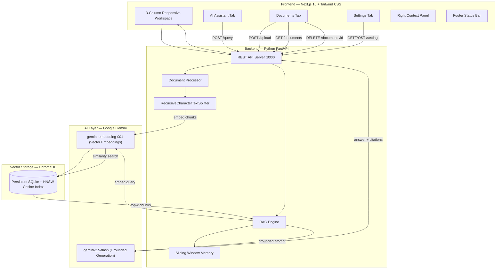

# Enterprise AI Knowledge Hub (RAG)

An enterprise-grade Retrieval-Augmented Generation (RAG) platform powered by **Next.js 16**, **Python FastAPI**, **ChromaDB**, and **Google Gemini** (`gemini-2.5-flash` generation & `gemini-embedding-001` vector embeddings).

---

## Problem Statement

Enterprise organizations accumulate thousands of multi-format documents (PDF reports, policy handbooks, financial statements, SOPs, and onboarding guides) across disparate file shares. Searching through these documents manually causes severe productivity bottlenecks, while relying on general-purpose LLMs leads to hallucinations and outdated answers. The Enterprise AI Knowledge Hub bridges this gap by embedding multi-format enterprise files into a vector store and utilizing grounded RAG synthesis to deliver accurate, citation-backed answers in real time.

---

## System Architecture



---

## RAG Pipeline Flow

```mermaid
flowchart TD
    subgraph Ingestion ["1. Document Ingestion Pipeline"]
        A([Uploaded File]) --> B{File Extension}
        B -->|PDF| C1[PyPDF Extract]
        B -->|DOCX| C2[python-docx Extract]
        B -->|TXT/MD| C3[UTF-8 Decode]
        B -->|HTML| C4[BeautifulSoup4 Clean]
        C1 & C2 & C3 & C4 --> D[Cleaned Text]
        D --> E[RecursiveCharacterTextSplitter\nchunk_size=1000, overlap=200]
        E --> F[Gemini gemini-embedding-001\nRETRIEVAL_DOCUMENT Task]
        F --> G[(ChromaDB Persistent Store)]
    end

    subgraph Retrieval ["2. Query & Generation Pipeline"]
        H([User Natural Language Query]) --> I[Gemini gemini-embedding-001\nRETRIEVAL_QUERY Task]
        I --> J[ChromaDB Cosine Similarity Search]
        J --> K{Similarity Threshold Filter\nrelevance_score >= threshold}
        K -->|Pass| L[Top-K Chunks Assembly]
        K -->|Fail All| M[Empty Context -> Fallback Answer]
        L --> N[Grounded Prompt Construction\nSYSTEM + HISTORY + CONTEXT + QUERY]
        N --> O[Gemini gemini-2.5-flash Text Synthesis]
        O --> P([Response with Expandable Source Citations])
    end
```



---

## Prerequisites

- **Python**: 3.10+
- **Node.js**: 18+
- **Google Gemini API Key**: Free at [Google AI Studio](https://aistudio.google.com/apikey)

---

## Quick-Start Guide

For detailed component setups, see the sub-directory READMEs:
- 📖 [Backend Setup & API Reference](backend/README.md)
- 📖 [Frontend Setup & Directory Structure](frontend/README.md)

### Step 1: Clone & Configure Backend

```bash
cd backend
python -m venv venv
# Windows:
.\venv\Scripts\Activate.ps1
# Linux/macOS:
source venv/bin/activate

pip install -r requirements.txt
copy .env.example .env
# Edit .env and paste your GEMINI_API_KEY
```

Run FastAPI server:
```bash
uvicorn main:app --host 0.0.0.0 --port 8000 --reload
```

### Step 2: Configure & Start Frontend

In a new terminal:
```bash
cd frontend
npm install
npm run dev
```

Open **http://localhost:3000** in your browser.

---

## Git Workflow & Conventions

### Branch Naming Convention

- `feature/<feature-name>`: New features (e.g. `feature/metadata-filtering`, `feature/dark-theme`)
- `fix/<bug-name>`: Bug fixes (e.g. `fix/threshold-enforcement`, `fix/embedding-model-404`)
- `docs/<doc-name>`: Documentation improvements (e.g. `docs/api-reference`)
- `refactor/<module>`: Refactoring existing code without functional changes

### Commit Message Standards (Conventional Commits)

Format: `<type>(<scope>): <short summary>`

Examples:
- `feat(backend): implement similarity threshold filtering in vectorstore`
- `feat(frontend): add hover-lift animations and gradient accents`
- `fix(rag): update generation model to gemini-2.5-flash with fallback`
- `docs(repo): add comprehensive sub-directory README files`

### Ignored Directories & Artifacts (`.gitignore`)

The repository configures `.gitignore` to exclude:
- **Environment**: `.env`, `.env.local`
- **Python**: `venv/`, `__pycache__/`, `*.pyc`
- **Node & Next.js**: `node_modules/`, `frontend/node_modules/`, `.next/`, `frontend/.next/`
- **Vector DB & File Storage**: `backend/chroma_db/`, `backend/uploads/`
